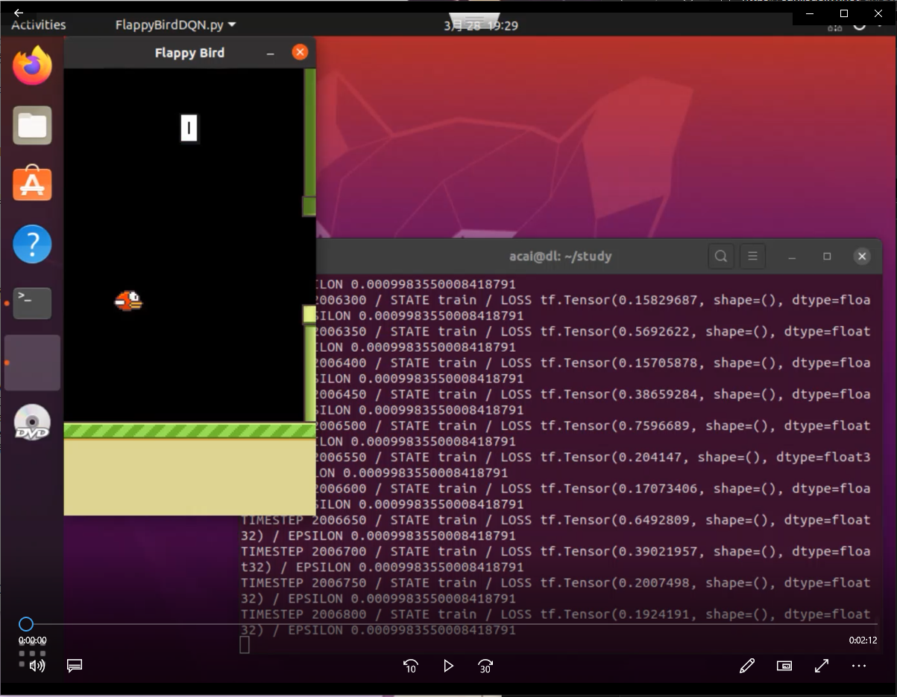

## 基于DQN的游戏AI
原始代码来自[floodsung](https://github.com/floodsung/DRL-FlappyBird)，我将其移植到`tensorflow2`，在此感谢大佬的工作.

### 训练测试命令：
```
python FlappyBirdDQN.py
```

### 200w次训练效果：
[](https://cdn.jsdelivr.net/gh/acai66/mydl@master/DQN_Flappy_Bird/demo/dqnFlappyBird.mp4)


### 当前测试依赖环境：
- tensorflow=2.1.0
- pygame
- openv-python

### 注意：
1. 当前`saved_networks`文件夹下保存的模型是已训练200w次的，如需重新训练，删掉里面的文件再运行训练命令即可。
2. 移植主要修改`BrainDQN_Nature.py`文件，原作者文件已重命名为`BrainDQN_Nature_backup.py`。
3. 更多细节请参阅原作者说明。

---
## 原作者README:
---

## Playing Flappy Bird Using Deep Reinforcement Learning (Based on Deep Q Learning DQN)

## Include NIPS 2013 version and Nature Version DQN


I rewrite the code from another repo and make it much simpler and easier to understand Deep Q Network Algorithm from DeepMind

The code of DQN is only 160 lines long.

To run the code, just type python FlappyBirdDQN.py

Since the DQN code is a unique class, you can use it to play other games.


## About the code

As a reinforcement learning problem, we knows we need to obtain observations and output actions, and the 'brain' do the processing work.

Therefore, you can easily understand the BrainDQN.py code. There are three interfaces:

1. getInitState() for initialization
2. getAction()
3. setPerception(nextObservation,action,reward,terminal)

the game interface just need to be able to feed the action to the game and output observation,reward,terminal


## Disclaimer
This work is based on the repo: [yenchenlin1994/DeepLearningFlappyBird](https://github.com/yenchenlin1994/DeepLearningFlappyBird.git)

